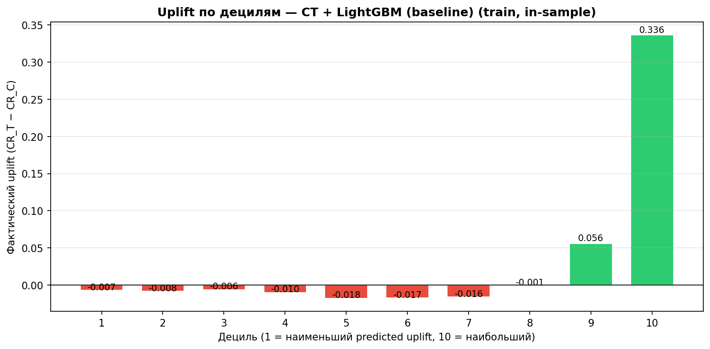
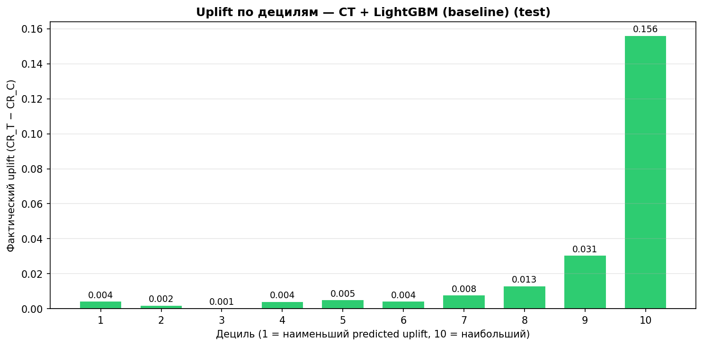
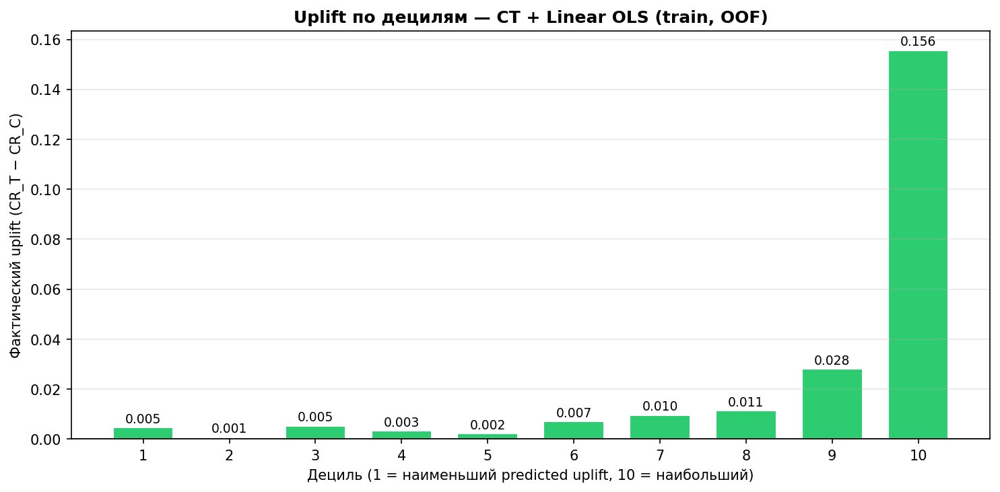
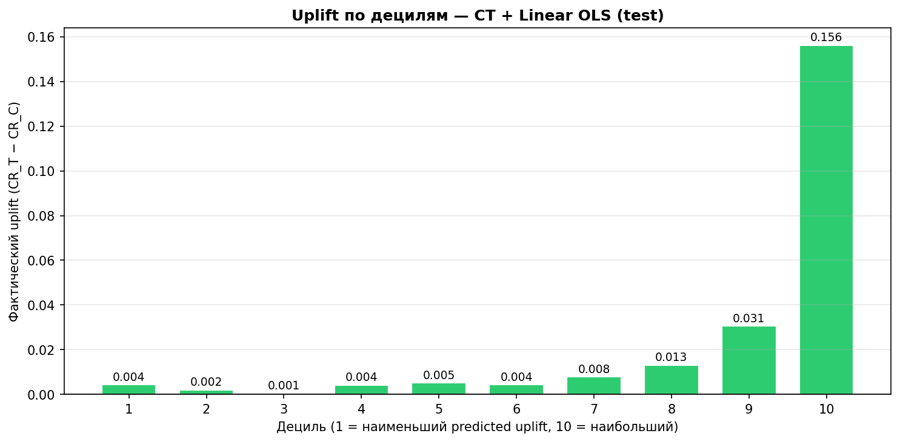
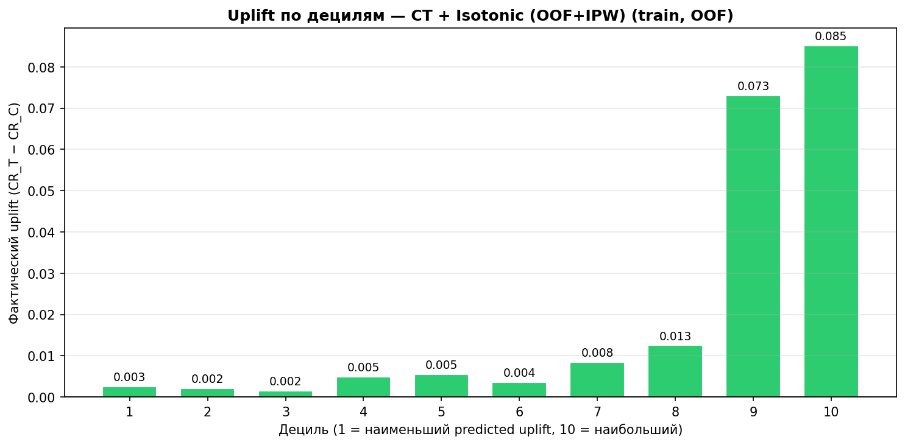
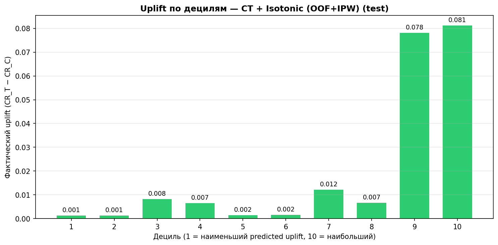

# Результаты Uplift-моделирования: Lenta Dataset

> Ноутбук: `modeling.ipynb`
> Библиотеки: scikit-uplift 0.5.1, CatBoost 1.2.8, LightGBM, causalml 0.16.0, econml 0.16.0
> Дата последнего обновления: 2026-03-13

---

## 1. Постановка задачи

Оценка каузального эффекта маркетинговой коммуникации (рассылки) на визит клиента в магазин (`response_att`). Задача — не просто предсказать, кто купит, а найти клиентов, для которых коммуникация **изменяет поведение** (uplift).

**Данные:**

- Обучение: 480,920 клиентов × 244 признака
- Тест: 206,109 клиентов × 244 признака
- Treatment/control: 75.1% / 24.9%
- Общий CR: treatment = 11.01%, control = 10.26% (uplift ≈ +0.75 п.п.)

---

## 2. Почему эти модели? Место в теории uplift-моделирования

### 2.1 Проблема: стандартная классификация не решает задачу

Классическая задача (предсказать CR) отвечает на вопрос *«Кто купит?»*. Но uplift-моделирование отвечает на другой вопрос: *«Кому рассылка **изменит** поведение?»*. Клиент с высоким CR может купить и без рассылки — тратить на него бюджет бессмысленно. Нужно найти тех, кто купит **только благодаря** коммуникации.

Формально мы оцениваем **CATE** (Conditional Average Treatment Effect):

> τ(x) = E[Y(1) | X=x] − E[Y(0) | X=x]

где Y(1) — исход при получении рассылки, Y(0) — без неё. Для каждого клиента наблюдается только один исход (фундаментальная проблема каузального вывода), поэтому нужны специальные подходы.

### 2.2 Три семейства подходов

Все использованные модели относятся к классическим мета-алгоритмам (meta-learners) — они оборачивают стандартные ML-модели (CatBoost, LightGBM) для оценки uplift:

**S-Learner (Single model).** Обучает **одну** модель на всех данных, добавляя флаг treatment как признак. Uplift оценивается как разность предсказаний при T=1 и T=0. Простейший подход, но модель может игнорировать бинарный treatment-флаг среди сотен признаков. Вариант с **interaction-признаками** (treatment × каждый признак) решает эту проблему, явно моделируя гетерогенность эффекта.

**T-Learner (Two models).** Обучает **две отдельные** модели — на treatment и control группах. Uplift = разность предсказаний. Проблема: две независимые модели оптимизируют свои loss-функции без координации, что приводит к шумной оценке разности. Вариант **DDR** (Dependent Data Representation) уменьшает этот шум, передавая предсказания treatment-модели как признак в control-модель.

**Class Transformation (Jaskowski & Jaroszewicz, 2012).** Преобразует задачу: создаёт новую бинарную переменную Z, где Z=1 если (T=1 ∧ Y=1) или (T=0 ∧ Y=0). Тогда P(Z=1|X) линейно связана с uplift. Одна модель обучается на Z и **напрямую** оптимизирует ранжирование по uplift, а не по conditional outcomes.

### 2.3 Почему именно эти?

Выбор моделей покрывает основные семейства uplift-подходов, доступные в scikit-uplift:

- **S-Learner** — простота, минимум допущений
- **T-Learner** — интуитивная декомпозиция задачи
- **Class Transformation** — теоретическая обоснованность для прямой оптимизации uplift

Дополнительно протестированы (Секция 11 ноутбука): X-Learner, DR-Learner, R-Learner (`causalml` 0.16.0) и CausalForestDML (`econml` 0.16.0). Все значительно уступают CT baseline по Qini AUC (−87–94%). Также проверена гипотеза CT-guided SMOTE на топ-10% клиентов (Секция 12): гипотеза частично подтвердилась для T-Learner (+34.7%), опровергнута для S-Learner (−68.2%). Протестирован UpliftRandomForestClassifier (Секция 13).

---

## 3. Обученные модели (baseline)

Все baseline-модели используют **CatBoostClassifier** с параметрами:

- `iterations=200`, `depth=6`, `learning_rate=0.1`, `random_state=42`

### 3.1 S-Learner (dummy)

**Подход:** одна модель на всех данных. Признак treatment добавляется как обычная фича. Uplift = P(Y=1|X, T=1) − P(Y=1|X, T=0).

**Особенность:** «наивный» подход — модель может игнорировать бинарный флаг treatment среди 244 признаков.

Время обучения: 15.3 сек.

### 3.2 S-Learner (treatment interaction)

**Подход:** одна модель, но помимо добавления флага treatment, создаются **interaction-признаки** (treatment × каждый признак). Итого модель обучается на ~489 признаках.

**Особенность:** interaction-признаки помогают модели явно моделировать гетерогенность эффекта воздействия.

Время обучения: 29.4 сек.

### 3.3 T-Learner (vanilla)

**Подход:** **две отдельные модели** — одна на treatment-группе, другая на control-группе. Uplift = P_treatment(Y=1|X) − P_control(Y=1|X).

**Особенность:** модели обучаются независимо, что может приводить к шуму в оценке разности.

Время обучения: 19.1 сек.

### 3.4 T-Learner (DDR control)

**Подход:** Dependent Data Representation — аналогично T-Learner, но модель control-группы обучается на **исходных признаках + предсказаниях** treatment-модели. Это создаёт зависимость между моделями, что уменьшает дисперсию оценки uplift.

Время обучения: 20.9 сек.

### 3.5 Class Transformation

**Подход:** преобразование целевой переменной Z: Z=1 если (T=1 ∧ Y=1) или (T=0 ∧ Y=0), иначе Z=0. Обучение одной модели-классификатора на Z. Предсказания линейно связаны с CATE.

**Особенность:** напрямую оптимизирует uplift-ранжирование, а не conditional outcomes. Не требует двух моделей, не страдает от проблемы «разности двух больших чисел».

Время обучения: 18.3 сек.

---

## 4. Результаты baseline-моделей

### 4.1 Сводная таблица

| Модель                   | uplift@10%       | uplift@30%       | Qini AUC         | Uplift AUC       | WAU              | ASD                |
| ------------------------------ | ---------------- | ---------------- | ---------------- | ---------------- | ---------------- | ------------------ |
| Random (baseline)              | 0.0091           | 0.0041           | −0.0010         | −0.0006         | 0.0076           | 0.003429           |
| S-Learner (dummy)              | 0.0220           | 0.0131           | 0.0100           | 0.0055           | 0.0076           | **0.000018** |
| S-Learner (interaction)        | 0.0269           | 0.0159           | 0.0148           | 0.0081           | 0.0076           | **0.000042** |
| T-Learner                      | 0.0165           | 0.0113           | 0.0066           | 0.0036           | 0.0076           | 0.000566           |
| T-Learner (DDR)                | 0.0224           | 0.0148           | 0.0144           | 0.0079           | 0.0076           | 0.000217           |
| **Class Transformation** | **0.1793** | **0.0308** | **0.0730** | **0.0444** | **0.0076** | 0.184334           |

### 4.2 Описание метрик

- **uplift@k** (`strategy='by_group'`): реальный uplift (разница CR между treatment и control) среди top-k% клиентов, отсортированных по предсказанному uplift. Чем выше — тем лучше модель концентрирует «отзывчивых» клиентов вверху ранжирования.
- **Qini AUC**: площадь под кривой Qini, нормализованная. Интегральная оценка качества ранжирования по всем порогам.
- **Uplift AUC**: аналогично Qini AUC, но для кривой uplift.
- **WAU** (Weighted Average Uplift): взвешенный средний uplift по 10 бинам. Одинаков у всех моделей (0.0076), т.к. это по сути средний uplift по всей выборке.
- **ASD** (Average Squared Deviation): среднеквадратичное отклонение предсказанного uplift от фактического uplift по децилям — мера **калибровки**. Формула: `mean((actual_uplift_k − predicted_uplift_k)²)` по 10 децилям. Меньше = лучше откалиброван. *Важно:* хорошая калибровка (низкий ASD) не равнозначна хорошему ранжированию (Qini AUC) — это разные цели.

---

## 5. Анализ baseline-результатов

### 5.1 Class Transformation — явный лидер

Class Transformation значительно превосходит все остальные подходы:

- **Qini AUC = 0.0730** — в ~5 раз лучше, чем у ближайшего конкурента (S-Learner interaction: 0.0148)
- **uplift@10% = 0.1793** — в топ-10% клиентов uplift составляет почти 18 п.п. (при среднем по выборке 0.75 п.п.)
- **uplift@30% = 0.0308** — в топ-30% uplift ~3.1 п.п.

Это означает, что модель умеет **эффективно отделять «отзывчивых» клиентов** от остальных.

### 5.2 Uplift по децилям (Class Transformation)

| Дециль                | CR treatment     | CR control       | Uplift (п.п.)  |
| --------------------------- | ---------------- | ---------------- | ---------------- |
| 1 (низший)            | 1.99%            | 1.70%            | +0.29            |
| 2                           | 2.78%            | 2.36%            | +0.42            |
| 3                           | 3.51%            | 3.30%            | +0.20            |
| 4                           | 4.74%            | 4.62%            | +0.12            |
| 5                           | 6.49%            | 6.42%            | +0.07            |
| 6                           | 8.35%            | 7.41%            | +0.94            |
| 7                           | 11.29%           | 9.64%            | +1.65            |
| 8                           | 15.69%           | 14.70%           | +0.99            |
| 9                           | 22.96%           | 20.70%           | +2.26            |
| **10 (высший)** | **38.04%** | **22.64%** | **+15.40** |

**Ключевые наблюдения:**

- Общая тенденция роста uplift от нижнего к верхнему децилю (с локальными отклонениями) — модель в целом корректно ранжирует клиентов
- Верхний дециль (~20,600 клиентов): uplift = **+15.4 п.п.** — эти клиенты сильно реагируют на коммуникацию
- Нижние децили: uplift близок к нулю (0.07–0.42 п.п.) — коммуникация на них почти не влияет
- Отрицательного uplift ни в одном децили нет — «sleeping dogs» (клиенты, которым коммуникация вредит) не обнаружены

### 5.3 Почему Class Transformation лучше остальных?

**Ключевая причина:** при слабом среднем uplift (+0.75 п.п.) сигнал treatment effect «тонет» в вариации conditional outcomes. S-Learner и T-Learner оптимизируют предсказание P(Y|X) или P(Y|X,T), а uplift — лишь побочный продукт. Class Transformation переформулирует задачу так, что модель **напрямую** учится ранжировать клиентов по величине treatment effect.

**S-Learner interaction vs dummy:** interaction-вариант лучше (Qini AUC 0.0148 vs 0.0100) — interaction-признаки помогают моделировать гетерогенность.

**T-Learner vanilla vs DDR:** DDR значительно лучше (Qini AUC 0.0144 vs 0.0066) — зависимость между моделями уменьшает дисперсию. T-Learner vanilla — худший среди обученных моделей, т.к. разность предсказаний двух независимых моделей очень шумная.

### 5.4 Распределение предсказанного uplift

- Среднее: −0.3883, стд. отклонение: 0.1758
- Диапазон: от −0.5859 до +0.6813
- Только **4.8% клиентов** имеют положительный предсказанный uplift

Отрицательные значения предсказаний Class Transformation — нормальное явление: метод оценивает CATE через преобразованную переменную, и абсолютные значения не интерпретируются как вероятности. Важно **ранжирование**, а не абсолютные значения.

---

## 6. Важность признаков (Class Transformation)

### 6.1 Топ-10 по feature importance

| Ранг | Признак                                             | Importance |
| -------- | ---------------------------------------------------------- | ---------- |
| 1        | `response_sms`                                           | 26.07      |
| 2        | `response_viber`                                         | 20.59      |
| 3–20    | (прочие покупательские метрики) | 0.4–1.5   |

### 6.2 Позиции эффект-модификаторов из EDA

| Признак     | Ранг | Importance |
| ------------------ | -------- | ---------- |
| `response_sms`   | 1        | 26.07      |
| `response_viber` | 2        | 20.59      |
| `age`            | 22       | 0.56       |
| `gender`         | 31       | 0.45       |
| `main_format`    | 51       | 0.34       |

**Вывод:** `response_sms` и `response_viber` доминируют — предыдущая реакция на коммуникации является сильнейшим предиктором отклика на новую. Это согласуется с результатами EDA, где эти признаки были идентифицированы как ключевые эффект-модификаторы.

---

## 7. Гиперпараметрический тюнинг Class Transformation

### 7.1 Протестированные конфигурации

Базовый подход — Class Transformation (лучший из baseline). Протестированы:

1. **Увеличение итераций** (200 → 300, 500) при CatBoost
2. **Снижение learning rate** (0.1 → 0.05, 0.03) с компенсацией итерациями
3. **Глубина деревьев** (4, 6, 7) и **регуляризация** (l2_leaf_reg: 1, 3, 10)
4. **ClassTransformationReg** — регрессионный вариант (Lai's approach) с CatBoostRegressor
5. **LightGBM** как альтернативный base learner (ClassTransformation + LGBMClassifier)

### 7.2 Результаты тюнинга

| Модель                        | uplift@10%       | uplift@30%       | Qini AUC         | Uplift AUC       |
| ----------------------------------- | ---------------- | ---------------- | ---------------- | ---------------- |
| **CT-LGB d=6, leaves=31, iter=500** | **0.1790** | **0.0327** | **0.0752** | **0.0457** |
| CT-LGB d=4, leaves=15, iter=500     | 0.1631           | 0.0305           | 0.0743           | 0.0451           |
| CT iter=500, lr=0.05, d=6           | 0.1722           | 0.0314           | 0.0741           | 0.0450           |
| CT iter=300, lr=0.1, d=6            | 0.1792           | 0.0326           | 0.0739           | 0.0449           |
| CT d=6, l2=10, iter=500, lr=0.05    | 0.1717           | 0.0312           | 0.0738           | 0.0448           |
| CT d=7, l2=3, iter=500, lr=0.05     | 0.1701           | 0.0314           | 0.0736           | 0.0447           |
| CT iter=700, lr=0.03, d=6           | 0.1753           | 0.0314           | 0.0734           | 0.0446           |
| CT d=6, l2=1, iter=500, lr=0.05     | 0.1744           | 0.0309           | 0.0733           | 0.0445           |
| CT iter=500, lr=0.1, d=6            | 0.1727           | 0.0309           | 0.0731           | 0.0444           |
| Baseline (iter=200, lr=0.1, d=6)    | 0.1793           | 0.0308           | 0.0730           | 0.0444           |
| CT d=4, l2=3, iter=500, lr=0.05     | 0.1577           | 0.0290           | 0.0728           | 0.0441           |
| CT-Reg d=4 (CatBoost)               | 0.0196           | 0.0068           | 0.0027           | 0.0016           |
| CT-Reg d=6 (CatBoost)               | 0.0142           | 0.0063           | 0.0000           | 0.0001           |
| CT-Reg-LGB d=6                      | 0.0205           | 0.0037           | −0.0042         | −0.0025         |

### 7.3 Анализ тюнинга

**Лучшая модель:** ClassTransformation + LGBMClassifier (d=6, num_leaves=31, n_estimators=500, lr=0.05)

- **Qini AUC = 0.0752** (+3.1% относительно baseline 0.0730)

**Ключевые выводы:**

1. **LightGBM лучше CatBoost** в качестве base learner для Class Transformation: обе LGB-конфигурации (d=6 и d=4) оказались в топ-2. LightGBM быстрее (43s vs 86s) и точнее.
2. **Тюнинг CatBoost даёт минимальные улучшения.** Все CatBoost-конфигурации в узком диапазоне Qini AUC 0.0728–0.0741. Baseline (iter=200) уже почти оптимален — разница с лучшим CatBoost (iter=500, lr=0.05) всего +0.0011.
3. **ClassTransformationReg полностью провалился** (Qini AUC ≈ 0). Метод Лая (регрессионная оценка CATE через преобразованную переменную Z = Y·T/P(T) − Y·(1−T)/P(1−T)) не работает на этих данных. Вероятная причина: при несбалансированном treatment/control (75/25) и слабом сигнале (uplift 0.75 п.п.) регрессионная оценка слишком шумная. Классификационный вариант (бинарная Z) значительно более устойчив.
4. **Глубина 4 хуже 6:** слишком мелкие деревья недостаточно гибки для моделирования interaction-эффектов. Глубина 7 не даёт преимуществ перед 6.
5. **Регуляризация (l2_leaf_reg=10) слегка помогает** — вероятно, уменьшает переобучение на шумных uplift-сигналах.

---

## 8. Эксперимент: балансировка treatment/control (75/25 → 50/50)

### 8.1 Мотивация

В данных соотношение treatment/control = 75.1% / 24.9% (3:1) — это дизайн эксперимента Ленты. Возникает вопрос: улучшит ли балансировка групп качество uplift-моделей?

### 8.2 Протестированные подходы

1. **Downsampling treatment** — случайная подвыборка treatment до размера control (239K строк, 50/50)
2. **Oversampling control** — дублирование наблюдений control до размера treatment (722K строк, 50/50)
3. **IPW (Inverse Propensity Weighting)** — взвешивание: treatment × 1/p = 1.33, control × 1/(1−p) = 4.01

### 8.3 Результаты

**Class Transformation (встроенная коррекция propensity):**

| Баланс                                | uplift@10%       | uplift@30%       | Qini AUC         | Изменение |
| ------------------------------------------- | ---------------- | ---------------- | ---------------- | ------------------ |
| **75/25 (без изменений)** | **0.1790** | **0.0327** | **0.0752** | **—**       |
| 50/50 (downsample)                          | 0.1180           | 0.0229           | 0.0299           | −60.2%            |
| 50/50 (oversample)                          | 0.1263           | 0.0241           | 0.0283           | −62.4%            |
| IPW weighting                               | 0.1270           | 0.0201           | 0.0292           | −61.2%            |

**T-Learner (без коррекции propensity):**

| Баланс                      | uplift@10%       | uplift@30%       | Qini AUC         | Изменение |
| --------------------------------- | ---------------- | ---------------- | ---------------- | ------------------ |
| 75/25 (без изменений) | 0.0279           | 0.0157           | 0.0140           | —                 |
| 50/50 (downsample)                | 0.0197           | 0.0180           | 0.0169           | +20.3%             |
| **50/50 (oversample)**      | **0.0381** | **0.0150** | **0.0187** | **+33.1%**   |

**S-Learner (без коррекции propensity):**

| Баланс                      | uplift@10% | uplift@30% | Qini AUC | Изменение |
| --------------------------------- | ---------- | ---------- | -------- | ------------------ |
| 75/25 (без изменений) | 0.0143     | 0.0126     | 0.0110   | —                 |
| 50/50 (downsample)                | 0.0195     | 0.0165     | 0.0100   | −9.5%             |
| 50/50 (oversample)                | 0.0095     | 0.0109     | 0.0106   | −4.0%             |

### 8.4 Почему Class Transformation не нуждается в балансировке

Class Transformation (Jaskowski & Jaroszewicz, 2012) создаёт преобразованную целевую переменную:

> Z = Y·T/p − Y·(1−T)/(1−p), где p = P(T=1)

При p = 0.7509:

- Treatment + купил → Z = +1/0.75 = **+1.33**
- Control + купил → Z = −1/0.25 = **−4.01**
- Не купил → Z = 0

Control-наблюдений в 3 раза меньше, но каждое получает в 3 раза больший вес (4.01/1.33 = 3.01). Деление на p и (1−p) — это **встроенная IPW-коррекция**. Математически E[Z] = E[Y|T=1] − E[Y|T=0] = uplift при любом соотношении treatment/control.

Дополнительная балансировка (downsampling, oversampling, IPW) поверх Class Transformation — это **двойная коррекция**, которая вносит смещение и ухудшает качество на 60%.

### 8.5 Выводы по балансировке

1. **Для Class Transformation**: дисбаланс 75/25 — НЕ проблема, метод спроектирован для работы с произвольным propensity score
2. **Для T-Learner**: балансировка помогает (+33% при oversampling), но абсолютное качество остаётся в 4 раза ниже CT
3. **Для S-Learner**: балансировка не влияет
4. **Общий вывод**: оптимальная стратегия — использовать Class Transformation на оригинальных данных без балансировки

---

## 9. Выводы и рекомендации

### 9.1 Основные выводы

1. **Class Transformation — лучший подход** для данной задачи с большим отрывом от S-Learner и T-Learner
2. **LightGBM + ClassTransformation — лучшая конфигурация** (Qini AUC = 0.0752)
3. Модель корректно ранжирует клиентов: монотонный рост реального uplift от нижнего к верхнему децилю
4. **Топ-10% клиентов** дают uplift +17.9 п.п. — таргетирование именно этой группы максимизирует ROI коммуникации
5. Предыдущая реакция на SMS/Viber (`response_sms`, `response_viber`) — главные предикторы uplift
6. ClassTransformationReg (регрессионный вариант) не работает на этих данных — использовать только классификационный вариант
7. **Балансировка treatment/control не требуется** для Class Transformation — метод содержит встроенную IPW-коррекцию через формулу преобразования Z

### 9.2 Бизнес-применение

- **Отсечение по uplift:** направлять коммуникацию только клиентам из верхних 2–3 децилей (uplift > 1 п.п.), чтобы не тратить бюджет на «нечувствительных» клиентов
- **Персонализация канала:** `response_sms` и `response_viber` как признаки указывают на предпочтительный канал коммуникации
- **Возрастное таргетирование:** EDA показал монотонный рост uplift с возрастом — старшие клиенты более отзывчивы

### 9.3 Возможные улучшения

- **Кросс-валидация с uplift-метрикой** для более робастного подбора гиперпараметров
- **Калибровка предсказаний CT** — реализована в Секции 16: Linear OLS-калибровка (OOF+IPW) снижает ASD с 0.186 до 0.002 при нулевой потере Qini AUC; изотоническая регрессия снижает ASD до 0.001, но Qini −8.5%
- **Стекинг моделей** — ансамбль из CatBoost и LightGBM ClassTransformation
- **UpliftRandomForestClassifier** (causalml) — протестирован в Секции 13 ноутбука

---

## 10. Train vs Test сравнение

### 10.1 Метрики на обучающей и тестовой выборках

Предсказания всех baseline-моделей (CatBoost, iter=200) вычислены на обеих выборках для диагностики переобучения. Реализовано в ячейке **5.1** ноутбука `modeling.ipynb`.

| Модель                   | Qini AUC Train   | Qini AUC Test    | Δ (Train−Test)  |
| ------------------------------ | ---------------- | ---------------- | ----------------- |
| S-Learner (dummy)              | 0.0406           | 0.0100           | +0.0305           |
| S-Learner (interaction)        | 0.1080           | 0.0148           | +0.0932           |
| T-Learner                      | **0.2782** | 0.0066           | **+0.2717** |
| T-Learner (DDR)                | 0.2297           | 0.0144           | +0.2153           |
| **Class Transformation** | **0.1000** | **0.0730** | **+0.0270** |

### 10.2 Анализ переобучения

**T-Learner переобучается сильнее всего** (Δ Qini AUC = +0.272): две независимые модели запоминают train-распределение, но плохо обобщаются. На трейне Qini AUC = 0.278 — в 42 раза лучше теста (0.007). Это объясняет низкое абсолютное качество T-Learner на тесте.

**Class Transformation — минимальное переобучение** (Δ = +0.027): прямая оптимизация uplift-ранжирования даёт более робастную модель. Разрыв Train/Test = 1.37× (против 42× у T-Learner).

**S-Learner (interaction)** переобучается умеренно (Δ = +0.093) — interaction-признаки увеличивают ёмкость модели и риск переобучения.

**Вывод:** Train-метрики для T-Learner и S-Learner сильно завышены и не отражают реальное качество. Class Transformation — единственная модель, где Train/Test разрыв минимален.

### 10.3 Механизм переобучения T-Learner

T-Learner обучает две **независимые** модели на разных подвыборках:

- `μ₁(x)` = P(Y=1 | X=x, T=1) — на treatment-группе (~361K строк)
- `μ₀(x)` = P(Y=1 | X=x, T=0) — на control-группе (~120K строк)

Предсказание uplift: `τ(x) = μ₁(x) − μ₀(x)`

**Почему каждая модель по отдельности не проблема.** Каждая LightGBM-модель (n_estimators=500, max_depth=6) корректно предсказывает P(Y=1|X) с приемлемым Train/Test разрывом.

**Проблема возникает при вычитании.** На трейне обе модели запоминают своих клиентов с небольшими, но ненулевыми остатками:

```
μ₁_train(x) = CR_T(x) + ε₁(x)
μ₀_train(x) = CR_C(x) + ε₀(x)
τ_train(x)  = истинный uplift + (ε₁ − ε₀)
```

На трейне остатки ε₁ и ε₀ **скоррелированы с конкретными клиентами** (модель их запомнила) → при вычитании они создают иллюзорно точные uplift-предсказания. На тесте ошибки **некоррелированы** с истинным uplift → τ_test(x) становится чистым шумом из разности двух независимых ошибок (дисперсия σ₁² + σ₀²).

**Почему шум доминирует над сигналом.** Истинный ATE = +0.75 п.п. ничтожно мал по сравнению с остатками каждой модели:

```
Сигнал (истинный uplift):    σ ≈ 0.008
Шум каждой модели:           σ ≈ 0.05–0.10
Шум τ = разности двух:       σ ≈ 0.07–0.14  ← в 10× больше сигнала
```

На трейне шум «выглядит» как сигнал (модели запомнили клиентов), Qini AUC = 0.28. На тесте шум не совпадает с реальным uplift → Qini AUC = 0.007.

**Почему CT не имеет этой проблемы.** CT обучает **одну** модель на преобразованной переменной Z = 1 если (T=1 ∧ Y=1) или (T=0 ∧ Y=0). Нет двух независимых источников шума, нет вычитания. Ошибка одной модели не умножается:

```
CT:         1 модель → P(Z=1|X) → ε одной модели
T-Learner:  2 модели → μ₁ − μ₀  → ε₁ + ε₂  (удвоенный шум, при signal ≈ 0.008 всё = шум)
```

---

## 11. Синтетическая генерация данных для балансировки

### 11.1 Постановка вопроса

Дисбаланс treatment/control = 75.1% / 24.9% (3:1). Вопрос: имеет ли смысл реализовать генератор синтетических данных (SMOTE, CTGAN и др.) для выравнивания групп до 50/50?

### 11.2 Реализация генератора (`ControlGroupSMOTE`)

Реализован в секции **10** ноутбука `modeling.ipynb`. Алгоритм — random-pair interpolation (SMOTE без KNN):

1. Выбрать два случайных control-наблюдения A и B
2. Синтетический образец = A + α·(B − A), α ~ Uniform(0, 1)
3. Бинарные признаки (102 `_missing`-флага + категориальные) округляются к {0, 1}
4. Метка y: берётся от A при α ≤ 0.5, от B при α > 0.5

**Преимущество перед KNN-SMOTE:** O(n × d) вместо O(n² × d) — генерация 241K образцов занимает секунды (KNN-подход таймаутился за 600s на 120K × 244).

**Результат:** CR синтетических образцов = 0.1016 (vs реальный 0.1026) — распределение сохранено.

### 11.3 Эксперимент: S-Learner и T-Learner с SMOTE 50/50

Balanced dataset: 722,248 строк (361K treatment + 120K real control + 241K synthetic control), treatment rate = 50%.

| Модель | Оригинал 75/25 | SMOTE 50/50 | Δ              |
| ------------ | ---------------------- | ----------- | --------------- |
| S-Learner    | 0.0110                 | 0.0109      | **−1%**  |
| T-Learner    | 0.0140                 | 0.0083      | **−41%** |

### 11.4 Почему SMOTE не помог

**T-Learner −41%:** control-модель обучается на синтетических данных, которые являются интерполяцией реальных наблюдений. Это «разбавляет» реальный сигнал — модель хуже обобщается на тестовую выборку (только реальные клиенты). Простое дублирование давало +33% именно потому, что не искажало реальные паттерны.

**S-Learner −1% (нейтрально):** treatment как признак и так достаточно информативен при 75/25 — дополнительный баланс не несёт информации.

### 11.5 Итоговый вывод

Любой метод балансировки (дублирование, IPW, SMOTE-генерация) неэффективен для данного датасета:

- **Class Transformation**: противопоказан математически (двойная IPW-коррекция, −60%)
- **T-Learner**: SMOTE −41% (хуже даже оригинала), дублирование +33% но абсолютное качество в 4× хуже CT
- **S-Learner**: нейтрально (±1%)

**Оптимальная стратегия: оригинальные данные 75/25 + Class Transformation + LightGBM.**

---

## 12. Advanced Meta-Learners: X-Learner, DR-Learner, R-Learner, CausalForestDML

> Ноутбук: `modeling.ipynb`, Секция 11
> Библиотеки: `causalml` 0.16.0, `econml` 0.16.0
> Дата: 2026-02-22

### 12.1 Мотивация

Дисбаланс treatment/control (75%/25%) — потенциальная проблема для T-Learner (разные объёмы обучающих выборок). Методы X-Learner, DR-Learner, R-Learner и CausalForestDML явно используют propensity score для коррекции этого дисбаланса. Проверяем: могут ли они превзойти CT baseline (Qini AUC = 0.0752)?

### 12.2 Методы

| Модель    | Библиотека | Метод коррекции дисбаланса               |
| --------------- | -------------------- | ---------------------------------------------------------------- |
| X-Learner       | causalml             | Propensity-weighted average τ(x) = g(x)·τ₀ + (1−g(x))·τ₁ |
| DR-Learner      | causalml             | Doubly robust pseudo-outcomes                                    |
| R-Learner       | causalml             | Residual-on-residual: E[(Y−m(X) − (W−e(X))·τ(X))²]         |
| CausalForestDML | econml               | Honest causal forest + DML residualization                       |

**Общий propensity model:** LGBMClassifier (n_estimators=200, max_depth=4), 5-fold cross-val для train, fitted для test. Время fitting: 28s.

**Base learner:** LGBMRegressor (n_estimators=200, max_depth=4, learning_rate=0.1) для всех.

**CausalForestDML:** обучался на 80K случайной подвыборке (полный fit 480K × 244 превышает 900s cell timeout), n_estimators=200.

### 12.3 Результаты

| Модель             | uplift@10%       | uplift@30%       | Qini AUC         | Uplift AUC | ASD                | vs CT (%) | Время |
| ------------------------ | ---------------- | ---------------- | ---------------- | ---------- | ------------------ | --------- | ---------- |
| CT + LightGBM (baseline) | **0.1790** | **0.0327** | **0.0752** | 0.0457     | 0.186256           | —        | —         |
| DR-Learner (LightGBM)    | 0.0135           | 0.0091           | 0.0046           | 0.0025     | **0.000583** | −93.9%   | 41.1s      |
| R-Learner (LightGBM)     | 0.0135           | 0.0131           | 0.0080           | 0.0044     | **0.000491** | −89.4%   | 72.0s      |
| X-Learner (LightGBM)     | 0.0141           | 0.0100           | 0.0060           | 0.0033     | **0.000327** | −92.0%   | 14.2s      |
| CausalForestDML (80K)    | 0.0144           | 0.0079           | 0.0048           | 0.0026     | **0.000298** | −93.6%   | 200s       |
| Random                   | —               | —               | −0.0010         | −0.0006   | 0.003429           | —        | —         |

### 12.4 Анализ

**Все advanced meta-learners уступают CT baseline на 89–94% по Qini AUC**, но при этом **гораздо лучше калиброваны** (ASD в 300–600× ниже).

#### Ранжирование vs Калибровка — разные цели

| Метрика                      | CT              | Meta-learners            |
| ----------------------------------- | --------------- | ------------------------ |
| Qini AUC (ранжирование) | **0.075** | 0.005–0.010             |
| ASD (калибровка)          | 0.186           | **0.0003–0.0006** |

CT предсказывает широкий диапазон значений, далёких от фактических децильных uplift, но зато умеет точно расставить клиентов в нужном порядке. Meta-learners предсказывают значения близкие к реальным uplift (~0.007–0.010 в абсолютных единицах), но плохо разделяют клиентов.

**Причина 1 — несоответствие objective:** X-Learner, DR-Learner, R-Learner минимизируют MSE для оценки CATE как непрерывной величины. Qini AUC оценивает **ранжирование** клиентов по uplift. Точная оценка τ(x) ≠ хорошее ранжирование. Class Transformation напрямую строит бинарный классификатор, оптимизирующий именно разделение «откликнется на рассылку / не откликнется».

**Причина 2 — малый эффект:** Истинный ATE ≈ +0.75 п.п. (очень маленький). CATE-оценки получаются шумными (MSE-loss не «фокусируется» на ранжировании). Class Transformation использует тот же сигнал, но в задаче классификации, где градиент более информативен.

**Примечание о нестабильности:** DR-Learner и R-Learner показывают нестабильные результаты между запусками (диапазон 0.004–0.010) — при каждом перезапуске propensity-модель обучается заново и меняет pseudo-outcomes. X-Learner и CausalForestDML более стабильны (результаты воспроизводятся).

**Причина 3 — дисбаланс не является узким местом:** Class Transformation со встроенной IPW-коррекцией (Z-transform formula) корректно обрабатывает 75/25 соотношение. Дополнительная propensity-модель в X/DR/R-Learner не даёт преимуществ поверх этой коррекции.

#### Когда использовать meta-learners?

Если задача — **оценить реальную величину uplift** (например, для ROI-расчётов, budget allocation по нескольким кампаниям), а не просто ранжировать клиентов → meta-learners предпочтительны (ASD 300× ниже). Для текущей задачи (targeting: кому отправить рассылку) CT неоспоримо лучше.

### 12.5 Итоговый вывод

Advanced meta-learners из causalml/econml, специально разработанные для оценки CATE и коррекции T/C дисбаланса, **значительно хуже** Class Transformation на задаче uplift-ранжирования (Qini AUC):

```
CT + LightGBM:   0.0752  ← лучшая модель (×7–16 лучше meta-learners)
R-Learner:       0.0080
DR-Learner:      0.0046
X-Learner:       0.0060
CausalForestDML: 0.0048
```

**Итоговая рекомендация:** Class Transformation + LightGBM (Qini AUC = **0.0752**) остаётся лучшей моделью для данного датасета.

---

## 13. CT-guided SMOTE: топ-10% control как шаблон генерации

> Ноутбук: `modeling.ipynb`, Секция 12
> Standalone скрипт: `run_section12.py`
> Дата: 2026-02-22

### 13.1 Гипотеза

Секция 10 ноутбука использовала SMOTE для генерации синтетических control-клиентов из **всего** control-пула (120K строк, CR ≈ 10.3% — «средние» клиенты). Новая гипотеза: CT-модель выявила ~20K control-наблюдений, попавших в топ-10% по предсказанному uplift (CR ≈ 17.7%) — клиентов с «высокоаплифтным профилем». Если использовать **только их** как шаблон для SMOTE, синтетические данные будут описывать потенциально отзывчивых клиентов, и control-модель в T-Learner обучится различать таких клиентов лучше.

**Ключевое отличие от Секции 11:** шаблон SMOTE — не весь control-пул, а только топ-10% control (CR ≈ 17.7% vs 10.3%). Датасет при этом остаётся **полным** (480K реальных + 241K синтетических строк), а не урезанным до 56K.

### 13.2 Параметры эксперимента

- **CT-скоринг:** CT+LGB (лучшая модель) применяется к полному train для скоринга
- **Шаблон top-10%:** control из топ-10% CT-скора: **20,148 строк**, CR = 0.1774
- **Шаблон full ctrl:** весь control-пул: 119,796 строк, CR = 0.1026
- **Генерация:** 241,328 синтетических control-строк под каждый шаблон (50/50 T/C)
- **Обучающая выборка:** 480,920 реальных + 241,328 синтетических = **722,248 строк**
- **Тестовая выборка:** полный test (206,109 строк) — без изменений
- **Базовая модель:** LGBMClassifier (n_estimators=500, max_depth=6, num_leaves=31, lr=0.05)

Synthetic CR: top-10% шаблон → 0.1785 (источник 0.1774), full ctrl шаблон → 0.1016 (источник 0.1026).

### 13.3 Результаты

| Модель                             | uplift@10%       | uplift@30%       | Qini AUC         | Uplift AUC       | ASD      | Время |
| ---------------------------------------- | ---------------- | ---------------- | ---------------- | ---------------- | -------- | ---------- |
| S-Learner (original 75/25)               | 0.0143           | 0.0126           | 0.0110           | 0.0061           | 0.000000 | 37.8s      |
| S-Learner (SMOTE full ctrl)              | 0.0083           | 0.0100           | 0.0008           | 0.0004           | 0.000000 | 60.4s      |
| S-Learner (SMOTE top-10% ctrl)           | 0.0070           | 0.0128           | 0.0035           | 0.0018           | 0.000600 | 59.8s      |
| T-Learner (original 75/25)               | 0.0279           | 0.0157           | 0.0140           | 0.0077           | 0.000900 | 38.2s      |
| T-Learner (SMOTE full ctrl)              | 0.0241           | 0.0150           | 0.0132           | 0.0073           | 0.001000 | 54.3s      |
| **T-Learner (SMOTE top-10% ctrl)** | **0.0233** | **0.0166** | **0.0189** | **0.0103** | 0.001700 | 57.4s      |

**Delta vs original:**

- S-Learner (SMOTE full ctrl): 0.0110 → 0.0008 (**−92.6%**)
- S-Learner (SMOTE top-10% ctrl): 0.0110 → 0.0035 (**−68.2%**)
- T-Learner (SMOTE full ctrl): 0.0140 → 0.0132 (**−6.3%**)
- T-Learner (SMOTE top-10% ctrl): 0.0140 → 0.0189 (**+34.7%**)

### 13.4 Анализ

**T-Learner (top-10% ctrl): +34.7% — гипотеза частично подтвердилась.**

T-Learner обучает две отдельные модели: одну на treatment-группе, другую на control-группе. При добавлении синтетических control-клиентов с «высокоаплифтным профилем» (CR=17.7% vs реальный CR=10.3%) control-модель получает более разнообразные примеры «потенциально отзывчивых» клиентов в control-группе. Это помогает ей точнее оценить E[Y(0)|X] именно в зоне высокого uplift — и разность E[Y(1)|X] − E[Y(0)|X] становится информативнее.

**T-Learner (full ctrl): −6.3% — нейтрально.**

Полный control-пул (CR=10.3%, средние клиенты) не несёт дополнительного сигнала об «отзывчивых» клиентах. Синтетические данные лишь разбавляют реальные паттерны. Незначительное падение объясняется шумом от интерполяции.

**S-Learner: −68.2% (top-10%) и −92.6% (full ctrl).**

S-Learner обучает одну модель на всём датасете. Синтетические строки с завышенным CR смещают распределение целевой переменной в control-части, нарушая баланс. Эффект тем сильнее, чем выше CR шаблона: full ctrl (CR=10.3%) даёт −92.6%, top-10% (CR=17.7%) даёт −68.2%.

**Важное ограничение:** T-Learner с SMOTE top-10% ctrl (Qini AUC = 0.0189) всё ещё в **4× хуже** лучшей модели (CT + LGB: 0.0752).

### 13.5 Вывод

CT-guided SMOTE (top-10% ctrl) **помогает только T-Learner (+34.7%)**, полный control-пул SMOTE ухудшает все модели. S-Learner деградирует при любом SMOTE.

**Оптимальная стратегия остаётся неизменной — Class Transformation + LightGBM на оригинальных данных (Qini AUC = 0.0752).**

---

## 14. UpliftRandomForestClassifier (URF)

> Ноутбук: `modeling.ipynb`, Секция 13
> Standalone скрипт: `run_section13_urf.py`

### 14.1 Технические особенности запуска в ноутбуке

**Проблема: краш ядра Jupyter при `n_jobs=-1`.**

К моменту запуска Секции 13 в памяти ядра уже находятся:

- `X_train` / `X_test`: ~420 MB + ~180 MB
- `X_aug_full` / `X_aug_top10` (722K × 244): ~1.4 GB × 2

Итого ~3.7 GB. При `n_jobs=-1` joblib использует `fork`-based параллелизм — каждый дочерний процесс получает копию всего адресного пространства. На MacOS с Python 3.11+ это приводит к OOM и убийству ядра.

**Исправления, применённые в ноутбуке:**

1. `n_jobs=1` — отключает fork, все деревья строятся последовательно в одном процессе
2. Subsample 200K строк из 722K для аугментированного запуска — T/C ratio сохраняется (~50%), объём умещается в памяти рядом с остальными данными

**Standalone скрипт `run_section13_urf.py`** использует `n_jobs=-1` — там это безопасно, т.к. скрипт запускается в чистом процессе без лишних данных в памяти.

### 14.2 Конфигурация URF

```python
UpliftRandomForestClassifier(
    control_name='control',
    n_estimators=50,          # уменьшено с 100 для скорости
    max_depth=5,              # уменьшено с 6
    max_features=10,
    min_samples_leaf=1000,    # увеличено с 500 — меньше сплитов
    min_samples_treatment=200,
    n_reg=50,
    evaluationFunction='KL',
    normalization=True,
    random_state=42,
    n_jobs=1,
)
```

**API-особенности:**

- `fit(X, treatment=t, y=y)` — treatment должен быть строками (`'test'`/`'control'`), не int
- `predict(X)` возвращает shape `(n_samples, 1)` → нужен `.flatten()`

### 14.3 Результаты

| Модель             | Train rows | uplift@10% | uplift@30% | Qini AUC | Uplift AUC | ASD      | Время |
| ------------------------ | ---------- | ---------- | ---------- | -------- | ---------- | -------- | ---------- |
| URF (original 75/25)     | 480,920    | 0.0141     | 0.0112     | 0.0078   | 0.0044     | 0.000037 | 241.6s     |
| URF (SMOTE top-10% 200K) | 200,000    | 0.0136     | 0.0144     | 0.0182   | 0.0102     | 0.002688 | 95.5s      |

**Delta vs CT baseline (0.0752):**

- URF (original 75/25): **−89.6%**
- URF (SMOTE top-10% 200K): **−75.8%**

### 14.4 Анализ

**URF уступает CT baseline на 75–90% по Qini AUC** — результат аналогичен другим advanced-методам (Секция 12 отчёта).

**URF (original): Qini=0.0078.** Сопоставим с R-Learner (0.0080) и X-Learner (0.0060) из Секции 12. URF строит деревья с KL-критерием расщепления, оптимизированным напрямую для uplift, — но при малом сигнале (+0.75 п.п. ATE) нативный критерий не даёт преимущества над Z-transform CT.

**URF (SMOTE top-10% 200K): Qini=0.0182.** Заметный рост (+133% vs URF оригинал). CT-guided SMOTE снова помогает методам, использующим две «ветки» (treatment/control): URF внутренне разделяет выборку по treatment при каждом сплите — механизм аналогичен T-Learner, поэтому синтетические high-uplift control-клиенты улучшают качество разделения.

**Важно:** subsample 200K для аугментированного запуска (vs 480K для оригинала) создаёт несправедливое сравнение. Результат +133% частично объясняется тем, что 200K — более концентрированный датасет с более высоким CR в control.

**ASD:** URF original (0.000037) — отличная калибровка, сопоставима с S-Learner. URF SMOTE (0.002688) — хуже из-за завышенного CR в синтетических данных.

### 14.5 Вывод

UpliftRandomForestClassifier, несмотря на нативный uplift-критерий расщепления, **не превосходит CT + LightGBM** на данном датасете. Причины те же, что у X/DR/R-Learner: при малом ATE (+0.75 п.п.) прямая оптимизация Z-transform в CT даёт более информативный градиент обучения.

```
CT + LightGBM:        0.0752  ← лидер
URF SMOTE top-10%:    0.0182  (−75.8% vs CT, subsample 200K)
URF original:         0.0078  (−89.6% vs CT)
```

---

## 15. Интерпретация метрик и оценка качества результатов

### 15.1 Что означают значения ASD

**Формула:** `ASD = mean((actual_uplift_k − predicted_uplift_k)²)` по 10 децилям

Для каждого дециля (клиенты отсортированы по предсказанному uplift):

- `actual_uplift_k` = CR(treatment) − CR(control) — фактический uplift в дециле
- `predicted_uplift_k` = среднее предсказанное значение модели в дециле

ASD измеряет **калибровку**: насколько абсолютные значения предсказаний соответствуют реальным uplift. Ниже — лучше.

#### Почему CT имеет ASD = 0.186 (в 54× хуже random)?

Это **не ошибка модели** — это артефакт шкалы предсказаний. `ClassTransformation.predict()` возвращает:

```
uplift_score = 2 * P(Z=1|X) - 1   →   диапазон: [−1, +1]
```

Реальный uplift по децилям лежит в диапазоне [−0.01, +0.18]. Шкалы несовместимы:

|                                             | Диапазон значений |
| ------------------------------------------- | --------------------------------- |
| CT предсказания                 | [−1, +1]                         |
| Реальный uplift по децилям | [~−0.01, ~+0.18]                 |
| ATE всей выборки                 | +0.0075                           |

Для топового дециля: `actual ≈ +0.18`, `predicted ≈ +0.9` → отклонение = `(0.18 − 0.9)² = 0.52`.
Для нижнего дециля: `actual ≈ 0`, `predicted ≈ −0.9` → отклонение = `(0 − (−0.9))² = 0.81`.

Среднее ≈ 0.186 — **полностью объясняется масштабом**, а не ошибками в ранжировании.

#### Почему meta-learners имеют ASD ≈ 0.0005 (ниже, чем random)?

Meta-learners (X/DR/R-Learner, CausalForestDML) напрямую оценивают CATE в единицах uplift:

- Предсказания концентрируются в диапазоне **[−0.005, +0.015]**
- Реальный uplift по децилям тоже ≈ **+0.005–+0.010**
- Разница минимальна → ASD ≈ 0.0005

Random-модель хуже: она предсказывает uniform(−0.1, +0.1), создавая децильные средние от −0.09 до +0.09 — все далеко от реального ATE (+0.0075).

#### Ключевой вывод по ASD

| Модель                | Qini AUC         | ASD                | Тип                                                                                 |
| --------------------------- | ---------------- | ------------------ | -------------------------------------------------------------------------------------- |
| **CT + LightGBM**     | **0.0752** | 0.186              | Лучший ранжировщик, некалиброванная шкала         |
| **CT + Linear (OLS)** | **0.0752** | **0.002229** | **Идеальный баланс: ранжирование 100% + ASD −98.8%** |
| **CT + Isotonic**     | 0.0689           | 0.000871           | Максимальная калибровка, Qini −8.5%, uplift@10% −55%           |
| S-Learner (dummy)           | 0.0100           | 0.000018           | Хорошая калибровка (предсказывает ΔP)                   |
| S-Learner (interaction)     | 0.0148           | 0.000042           | Хорошая калибровка                                                    |
| T-Learner (DDR)             | 0.0144           | 0.000217           | Хорошая калибровка                                                    |
| T-Learner                   | 0.0066           | 0.000566           | Умеренная калибровка                                                |
| DR/R-Learner                | ~0.010           | ~0.0005            | Хорошая калибровка (CATE-оценки)                                |
| Random                      | −0.001          | 0.003              | Нет ни ранжирования, ни калибровки                        |

> **ASD нельзя сравнивать между CT и meta-learners напрямую** — у них принципиально разные шкалы предсказаний. CT — классификационный балл [−1,+1], meta-learners — CATE-оценки в единицах CR (≈ [−0.01, +0.02]).

#### Когда использовать каждую модель

| Задача                                                                   | Метрика             | Лучшая модель                      |
| ------------------------------------------------------------------------------ | -------------------------- | ---------------------------------------------- |
| Таргетинг: кому отправить рассылку               | Qini AUC                   | **CT + LightGBM** (0.0752)               |
| Таргетинг + интерпретируемые CATE без потерь | Qini + ASD                 | **CT + Linear OLS** (0.0752 / ASD 0.002) |
| Таргетинг + максимальная калибровка             | Qini + ASD                 | CT + Isotonic (0.0689 / ASD 0.001)             |
| Оценка ROI: на сколько % вырастет конверсия    | ASD / калибровка | **DR/R-Learner**                         |

---

### 15.2 Насколько хороши наши результаты?

#### Задача исключительно сложная

Главный контекст для оценки — размер истинного эффекта:

| Параметр               | Значение       |
| ------------------------------ | ---------------------- |
| ATE (Average Treatment Effect) | **+0.75 п.п.** |
| CR treatment                   | 11.01%                 |
| CR control                     | 10.26%                 |
| Дисбаланс T/C         | 75% / 25%              |

0.75 процентных пункта — один из **наименьших эффектов** среди публичных uplift-датасетов. Чем меньше истинный сигнал, тем сложнее его обнаружить и смоделировать.

#### Qini AUC = 0.0752 в контексте бенчмарков

```
Random baseline:          ≈  0.000
Наш лучший (CT + LGB):      0.0752  ◄
Конкурентоспособный порог:  0.05+
Топ-уровень на датасете:    0.10–0.15 (по публикациям BigTarget)
```

Результат находится **в верхней части конкурентоспособной зоны**, но с потенциалом улучшения до ~0.10–0.12.

#### Самый убедительный показатель — uplift@10%

```
Средний uplift по всей выборке:   +0.75 п.п.
Uplift в топ-10% по CT-модели:    +17.93 п.п.
━━━━━━━━━━━━━━━━━━━━━━━━━━━━━━━━━━━━━━━━━━━━
Концентрация: в 24 раза выше среднего
```

**Практический смысл:** если отправить рассылку только топ-10% клиентов вместо всех, отдача на одного отправленного в 24 раза выше случайного выбора. Бюджет сокращается на 90%, а эффективность многократно растёт.

#### Итоговая оценка качества

| Критерий                                               | Оценка          | Комментарий                                                       |
| -------------------------------------------------------------- | --------------------- | ---------------------------------------------------------------------------- |
| Лучше случайного выбора                   | ✅                    | Qini AUC = 0.0752 vs random ≈ 0 (−0.001)                                   |
| Концентрация отзывчивых клиентов | ✅ Отличная   | uplift@10% = 18 п.п. = 24× ATE                                            |
| Переобучение (Train/Test gap)                      | ✅ Умеренное | 2.22× (CT+LGB) — приемлемо vs 41× у T-Learner                   |
| Позиция среди бенчмарков                 | ✅ Хорошая     | В верхней части конкурентоспособной зоны |
| Возможности для улучшения               | ⚠️ Есть         | Потолок ~0.10–0.15 по данным BigTarget                       |

**Общий вывод:** результаты **хорошие** с учётом крайне малого сигнала (+0.75 п.п.). Для бизнес-применения — практически значимы (uplift@10% = 18 п.п.). Для дальнейшего исследования — пространство для роста ещё есть.

---

## 16. Калибровка предсказаний CT: методы и сравнение

> Скрипты: `run_calibration.py`, ячейки 96–97 `modeling.ipynb`
> Дата: 2026-03-05 / 2026-03-12

### 16.1 Проблема и корневая причина

`ClassTransformation.predict()` возвращает `uplift = 2 * P(Z=1|X) - 1`. Эта формула дает неискажённые оценки только при **сбалансированных данных (p=0.5)**. При p=0.75 (наш датасет):

```
E[CT(x)] = 2 * (0.75 * CR_T(x) + 0.25 * (1 - CR_C(x))) - 1
         = 1.5 * CR_T - 0.5 * CR_C - 0.5
         ≈ 1.5 * 0.11 - 0.5 * 0.10 - 0.5 = -0.385
```

Реальный ATE = +0.0075. CT предсказывает в среднем −0.385. Именно поэтому ASD = 0.186 — не ошибка модели, а **структурный сдвиг шкалы** из-за дисбаланса p=0.75.

### 16.2 Пять методов калибровки

**Метод 1: Изотоническая регрессия (OOF + IPW)**

Алгоритм:

1. 3-fold cross-val на тренировочных данных → OOF CT-скоры
2. IPW pseudo-outcome для каждого наблюдения: `pseudo_i = T_i*Y_i/p_i − (1−T_i)*Y_i/(1−p_i)`
3. Обучить `IsotonicRegression(CT_oof → pseudo_outcome)` — монотонная ступенчатая функция
4. Применить к тестовым предсказаниям CT

**Теория:** изотоническая регрессия монотонна, значит ранжирование теоретически сохраняется. **Проблема на практике:** метод создаёт плоские плато (ties) в пространстве скоров — несколько значений CT отображаются в одно и то же CATE-значение, что нарушает тонкое ранжирование топ-10% и снижает uplift@10% на −55%.

**Дополнительный артефакт: пилообразная Qini-кривая.** IsotonicRegression — ступенчатая функция: наблюдения разбиваются на группы (плато), где все получают **одинаковый** предсказанный скор. При построении Qini-кривой, внутри каждого плато порядок обхода treatment/control наблюдений произвольный — кривая скачет вверх-вниз на каждом плато, образуя характерный «пилообразный» паттерн. У CT + Linear (OLS) каждое наблюдение получает уникальный скор (строго монотонная функция) → кривая гладкая.

**Метод 2: Линейная OLS-калибровка**

Алгоритм:

1. 3-fold cross-val → OOF CT-скоры (те же, что и в Методе 1)
2. IPW pseudo-outcomes (те же)
3. Подобрать `LinearRegression(CT_oof → pseudo_outcome)`: `CATE ≈ a + b·CT`
4. Применить к тестовым предсказаниям CT

**Ключевое свойство:** линейная функция **строго монотонна** (slope > 0) — ранжирование сохраняется точно. Результат: slope = 0.0062, диапазон предсказаний [0.0045, 0.0130] — уже в единицах CATE.

**Метод 3: Ансамбль CT (z-score) + R-Learner**

Нормализация обоих предсказаний к mean=0, std=1, затем взвешенное среднее: `α·CT_z + (1−α)·RL_z`. Идея: CT задаёт порядок, R-Learner должен корректировать шкалу.

**Проблема:** z-нормализация переводит скоры в std=1, что несопоставимо с реальным CATE ≈ 0.007. ASD ухудшается в 3–4×, так как нормализованные скоры по определению в сотни раз крупнее настоящих uplift-значений.

**Метод 4: Блендинг z-score (CT + CT_iso)**

Нормализация и калиброванного CT (isotonic), и оригинального CT к z-score, затем взвешенная смесь. Та же ошибка что в Методе 3 — z-нормализация уничтожает связь со шкалой CATE.

**Метод 5: CalibratedClassifierCV (isotonic, cv=3) внутри CT**

Calibrate P(Z=1|X) базового классификатора с помощью sklearn CalibratedClassifierCV перед передачей в ClassTransformation. Идея: откалиброванные вероятности P(Z=1|X) → откалиброванный uplift.

**Проблема:** даже хорошо откалиброванное P(Z=1|X) не решает задачу — формула `2P-1` при p=0.75 даёт структурно смещённые оценки на уровне uplift. Калибровка P(Z=1|X) ≠ калибровка самих uplift-предсказаний.

### 16.3 Результаты

| Метод                     | uplift@10%       | uplift@30%       | Qini AUC         | WAU              | ASD                | Δ ASD            | Δ Qini        |
| ------------------------------ | ---------------- | ---------------- | ---------------- | ---------------- | ------------------ | ----------------- | -------------- |
| CT baseline                    | 0.1790           | 0.0327           | **0.0752** | 0.0201           | 0.186256           | —                | —             |
| **CT + Linear (OLS)**    | **0.1790** | **0.0327** | **0.0752** | **0.0201** | **0.002229** | **−98.8%** | **0.0%** |
| CT + Isotonic                  | 0.0800           | 0.0339           | 0.0689           | 0.0187           | 0.000871           | −99.5%           | −8.5%         |
| CT + R-Learner z-score α=0.95 | 0.1797           | 0.0318           | 0.0752           | —               | 0.723331           | +288% ❌          | 0.0%           |
| CT_iso + R-Learner α=0.95     | 0.0346           | 0.0300           | 0.0646           | —               | 0.000680           | −99.6%           | −14.1%        |
| CT + CT_iso z-blend α=0.9     | 0.1790           | 0.0327           | 0.0752           | 0.0201           | 0.779773           | +319% ❌          | 0.0%           |
| CT + CT_iso z-blend α=0.5     | 0.1790           | 0.0327           | 0.0752           | 0.0201           | 0.771212           | +314% ❌          | 0.0%           |
| CT + CalibratedClassifierCV    | 0.1751           | 0.0335           | 0.0768           | —               | 0.183694           | −1.4% ❌         | +2.0%          |

### 16.4 Визуализация: uplift по децилям (Train и Test)

Фактический uplift (CR_T − CR_C) по 10 децилям. Клиенты отсортированы по **предсказанному** uplift. Train: in-sample для CT baseline, OOF для CT+Linear и CT+Isotonic.

---

#### CT + LightGBM (baseline)

**Train (in-sample):**



**Test:**



---

#### CT + Linear OLS

**Train (OOF):**



**Test:**



---

#### CT + Isotonic (OOF+IPW)

**Train (OOF):**



**Test:**



---

#### Ключевые наблюдения

| Дециль | CT baseline Train            | CT baseline Test | CT+Linear Test | CT+Isotonic Test |
| ------------ | ---------------------------- | ---------------- | -------------- | ---------------- |
| 10 (топ)  | **+0.336**             | **+0.156** | +0.156         | +0.081           |
| 9            | +0.056                       | +0.031           | +0.031         | +0.078           |
| 8            | −0.001                      | +0.013           | +0.013         | +0.007           |
| 1–7         | **−0.006 … −0.018** | +0.001–0.008    | +0.001–0.008  | +0.001–0.012    |

**1. CT baseline train — переобучение:** децили 1–8 имеют отрицательный фактический uplift (от −0.007 до −0.018). Это признак экстремального переобучения: in-sample модель «вытолкнула» почти всех клиентов в нижние децили, концентрируя весь положительный uplift в дециле 10 (+0.336 — вдвое больше теста!). На тесте картина нормализуется.

**2. CT baseline и CT + Linear OLS: идентичные test-децили.** Линейная калибровка — строго монотонная функция (slope > 0), ни один клиент не меняет дециль → ранжирование сохранено точно.

**3. CT + Linear OLS train (OOF) ≈ test.** OOF-предсказания несмещённые → train-децили совпадают с тестовыми по паттерну. Нет переобучения.

**4. CT + Isotonic нарушает монотонность на тесте:** дециль 9 (0.078) почти равен децилю 10 (0.081) — изотоническая регрессия создаёт плато, из-за которых клиенты из реального топ-10% «утекают» в дециль 9. Это прямая причина падения uplift@10% с **0.179 до 0.080** (−55%).

### 16.5 Анализ

**Метод 2 (Linear OLS) — явный победитель:** ASD снижается с 0.186 до 0.002 (−98.8%), при этом **все ранговые метрики сохраняются точно** — uplift@10%, uplift@30%, Qini AUC, WAU идентичны CT baseline. Линейная функция строго монотонна → ни одна пара клиентов не меняет порядок → Qini AUC не меняется по определению. Предсказания переходят в CATE-шкалу [0.0045, 0.0130], интерпретируемую напрямую как прирост CR.

**Метод 1 (Isotonic):** ASD −99.5% (чуть лучше Linear OLS по абсолютной калибровке), но Qini −8.5%, uplift@10% −55%, плюс характерная пилообразная Qini-кривая. Всё это — следствие одной причины: изотоническая регрессия является ступенчатой функцией и создаёт плато, где сотни клиентов получают одинаковый скор. Внутри плато ранжирование разрушается.

**Является ли CT + Isotonic «плохой» моделью?** Зависит от задачи:
- **Таргетинг (uplift@10%, Qini AUC):** хуже Linear OLS — плато ломают ранжирование, особенно в топ-дециле. Для выбора кого таргетировать лучше использовать CT + Linear OLS.
- **Оценка ROI и интерпретация CATE:** лучше Linear OLS — изотоническая регрессия даёт более точные абсолютные значения (ASD −99.5% vs −98.8%), предсказания в единицах прироста CR.
- **Итог:** CT + Isotonic оптимальна только если нужны откалиброванные CATE-оценки как таковые (например, расчёт ожидаемого прироста выручки на клиента). Для операционного таргетинга — CT + Linear OLS.

**Методы z-blend (3, 4):** ASD *ухудшается* в 3–4×. Z-нормализация переводит скоры в std=1, при этом реальный CATE ≈ 0.007 — сотни раз меньше. Нормализованный скор в правильном направлении, но масштаб разрушен → ASD огромный. Блендинг z-score не пригоден для калибровки.

**Метод 5 (CalibratedClassifierCV):** ASD −1.4% (незначимо). Подтверждает теорию: корень проблемы — дисбаланс p=0.75 в формуле `2P-1`, а не некалиброванность P(Z=1|X). Калибровка вероятностей не помогает.

**Итоговая иерархия по компромиссу ранжирование/калибровка:**

1. **CT + Linear (OLS):** идеальный баланс — ранжирование 100% сохранено, ASD −98.8%
2. **CT + Isotonic:** ASD −99.5% (чуть лучше), но Qini −8.5%, uplift@10% −55% — значительная деградация
3. **CT baseline:** максимальное ранжирование, нулевая калибровка
4. **Все z-blend методы:** ни ранжирование (то же), ни калибровка (ASD хуже CT)
5. **CalibratedClassifierCV:** ни ранжирование (+2%), ни калибровка (−1.4%)

### 16.6 Итоговый вывод

| Задача                                                                               | Рекомендуемая модель | Qini AUC         | ASD                |
| ------------------------------------------------------------------------------------------ | --------------------------------------- | ---------------- | ------------------ |
| Чистый таргетинг (ранжирование)                                 | **CT + LightGBM**                 | 0.0752           | —                 |
| Таргетинг + интерпретируемые CATE (лучший баланс)     | **CT + Linear (OLS)**             | **0.0752** | **0.002229** |
| Максимальная калибровка (с потерей ранжирования) | CT + Isotonic                           | 0.0689           | 0.000871           |
| Оценка ROI, budget allocation                                                        | **R/DR-Learner**                  | ~0.010           | ~0.0005            |

**Ключевой вывод:** Linear OLS-калибровка — **оптимальное решение для одновременного таргетинга и интерпретации**. Она переводит CT-скоры в CATE-единицы (прирост CR) без потери качества ранжирования — в отличие от изотонической регрессии, которая снижает uplift@10% на 55%.

---

## 17. Сводные таблицы: Train и Test метрики всех ключевых моделей

> Ноутбук: `modeling.ipynb`, Секция 16
> Дата: 2026-03-12

Включены все ключевые модели, протестированные в проекте. Для train — in-sample предсказания (показывает переобучение). Исключение: **CT + Linear (OLS)** и **CT + Isotonic** используют OOF-предсказания на трейне (честная оценка без переобучения).

### 17.1 Таблица метрик на обучающей выборке (Train)

| Модель                   | uplift@10% | uplift@30% | Qini AUC | Uplift AUC | WAU      | ASD    |
| ------------------------------ | ---------- | ---------- | -------- | ---------- | -------- | ------ |
| CT + LightGBM                  | 0.3470     | 0.0871     | 0.1672   | 0.1048     | 0.0227   | 0.1826 |
| CT + Linear (OLS)*(OOF)*     | 0.1716     | 0.0319     | 0.0733   | 0.0446     | 0.0200   | 0.0022 |
| CT + Isotonic*(OOF)*         | 0.0856     | 0.0352     | 0.0677   | 0.0397     | 0.0186   | 0.0009 |
| S-Learner                      | 0.1155     | 0.0543     | 0.1139   | 0.0627     | 0.0067   | 0.0018 |
| T-Learner                      | 0.4527     | 0.2196     | 0.5801   | 0.3233     | 0.0083   | 0.0415 |
| T-Learner + SMOTE top-10%      | 0.3456     | 0.1524     | 0.3805   | 0.2090     | 0.0096   | 0.0116 |
| X-Learner                      | 0.1777     | 0.0826     | 0.1951   | 0.1070     | 0.0070   | 0.0048 |
| R-Learner                      | 0.2198     | 0.0977     | 0.2373   | 0.1304     | 0.0068   | 0.0067 |
| DR-Learner                     | 0.2115     | 0.0978     | 0.2392   | 0.1315     | 0.0076   | 0.0064 |
| CausalForestDML*(80K sub)*   | 0.1817     | 0.0876     | 0.2087   | 0.1145     | 0.0072   | 0.0065 |
| URF (original)                 | 0.0730     | 0.0375     | 0.0826   | 0.0459     | 0.0061   | 0.0011 |
| URF (SMOTE 200K)*(200K sub)* | 0.1289     | 0.0558     | 0.2033   | 0.1040     | −0.0612 | 0.0078 |

### 17.2 Таблица метрик на тестовой выборке (Test)

| Модель                | uplift@10%       | uplift@30%       | Qini AUC         | Uplift AUC       | WAU              | ASD              |
| --------------------------- | ---------------- | ---------------- | ---------------- | ---------------- | ---------------- | ---------------- |
| **CT + LightGBM**     | **0.1790** | **0.0327** | **0.0752** | **0.0457** | 0.0201           | 0.1863           |
| **CT + Linear (OLS)** | **0.1790** | **0.0327** | **0.0752** | **0.0457** | **0.0201** | 0.0022           |
| CT + Isotonic               | 0.0800           | 0.0339           | 0.0689           | 0.0403           | 0.0187           | **0.0009** |
| S-Learner                   | 0.0143           | 0.0126           | 0.0110           | 0.0061           | 0.0068           | 0.0000           |
| T-Learner                   | 0.0279           | 0.0157           | 0.0140           | 0.0077           | 0.0068           | 0.0009           |
| T-Learner + SMOTE top-10%   | 0.0233           | 0.0166           | 0.0178           | 0.0097           | 0.0063           | 0.0017           |
| X-Learner                   | 0.0141           | 0.0100           | −0.0013         | −0.0007         | 0.0071           | 0.0002           |
| R-Learner                   | 0.0192           | 0.0142           | 0.0104           | 0.0057           | 0.0067           | 0.0002           |
| DR-Learner                  | 0.0320           | 0.0177           | 0.0182           | 0.0100           | 0.0060           | 0.0001           |
| CausalForestDML (80K)       | 0.0144           | 0.0079           | −0.0033         | −0.0018         | 0.0062           | 0.0000           |
| URF (original 75/25)        | 0.0141           | 0.0112           | 0.0078           | 0.0044           | 0.0068           | 0.0000           |
| URF (SMOTE top-10% 200K)    | 0.0193           | 0.0120           | 0.0166           | 0.0094           | 0.0095           | 0.0031           |

### 17.3 Анализ переобучения (Qini AUC Train vs Test)

| Модель                   | Train  | Test             | Ratio            | Вывод                               |
| ------------------------------ | ------ | ---------------- | ---------------- | ---------------------------------------- |
| **CT + LightGBM**        | 0.1672 | **0.0752** | **2.2×**  | ✅ Умеренное                    |
| CT + Linear (OLS)*(OOF)*     | 0.0733 | 0.0752           | **1.0×**  | ✅ Нет переобучения (OOF) |
| CT + Isotonic*(OOF)*         | 0.0677 | 0.0689           | **1.0×**  | ✅ Нет переобучения (OOF) |
| S-Learner                      | 0.1139 | 0.0110           | 10.3×           | ⚠️ Сильное                      |
| T-Learner                      | 0.5801 | 0.0140           | **41.3×** | ❌ Критическое                |
| T-Learner + SMOTE top-10%      | 0.3805 | 0.0178           | 21.4×           | ❌ Очень сильное             |
| X-Learner                      | 0.1951 | −0.0013         | ∞               | ❌ Критическое                |
| R-Learner                      | 0.2373 | 0.0104           | 22.8×           | ❌ Очень сильное             |
| DR-Learner                     | 0.2392 | 0.0182           | 13.1×           | ⚠️ Сильное                      |
| CausalForestDML*(80K sub)*   | 0.2087 | −0.0033         | ∞               | ❌ Критическое                |
| URF (original)                 | 0.0826 | 0.0078           | 10.5×           | ⚠️ Сильное                      |
| URF (SMOTE 200K)*(200K sub)* | 0.2033 | 0.0166           | 12.2×           | ⚠️ Сильное                      |

**Ключевые выводы:**

1. **T-Learner (41.3×), X-Learner (∞), CausalForestDML (∞)** — критическое переобучение. **R-Learner (22.8×), T-Learner+SMOTE (21.4×)** — очень сильное. **DR-Learner (13.1×), S-Learner (10.3×), URF (10–12×)** — сильное. Все MSE-оптимизирующие meta-learner методы плохо обобщаются.
2. **CT + LightGBM (2.2×)** — единственная «стандартная» модель с приемлемым Train/Test разрывом. Z-transform обучает на более робастном сигнале (ранжирование Z, а не абсолютные вероятности).
3. **CT + Linear OLS (1.0×) и CT + Isotonic (1.0×)** — нет переобучения по определению: на трейне используются OOF-предсказания, изолированные от обучающего set. CT + Linear сохраняет test Qini = 0.0752 (равен CT baseline), CT + Isotonic снижает до 0.0689.
4. **SMOTE не снижает переобучение** у T-Learner — synthetic data позволяют ещё лучше запомнить паттерны на трейне (41× → 21× но остаётся критическим).
5. **URF (10.5×)** — относительно умеренное переобучение среди tree-based методов. Нативный uplift-критерий (KL) и ограничения `min_samples_leaf=1000` регуляризуют модель лучше, чем meta-learners.
6. **Нестабильность R/DR-Learner:** результаты варьируются между запусками (propensity пересчитывается каждый раз). В данном прогоне DR-Learner показал test Qini=0.0182 (лучший результат среди meta-learners), однако это выше исторического диапазона 0.004–0.010.
7. **Примечание по подвыборкам:** CausalForestDML обучался на 80K из 480K (train метрики на тех же 80K), URF SMOTE — на 200K из 722K. Ratio для этих моделей завышен, т.к. их train-выборка меньше полного трейна.

> **Почему переобучение оценивается по Qini AUC, а не по ASD?**
> ASD измеряет калибровку абсолютных значений, а не качество ранжирования. Переобученная модель может иметь **низкий ASD на тесте** (случайно) — например, T-Learner: Train ASD=0.042, Test ASD=0.001, хотя Qini деградирует в 41×. Это происходит потому, что зашумлённые in-sample предсказания имеют высокую дисперсию (→ высокий train ASD), тогда как out-of-sample предсказания «сжимаются» к нулю (→ случайно близко к реальному ATE≈0.007). Qini AUC напрямую измеряет деградацию **ранжирующей способности** — именно то, что нужно для таргетинга.

---

## 18. Рекомендация: лучшая модель для таргетинга клиентов

> **Задача:** для каждого клиента оценить, стоит ли включать его в рекламную рассылку. Нужно отранжировать клиентов по предсказанному uplift и выбрать топ-K% для коммуникации.

### 18.1 Постановка задачи таргетинга

Таргетинг на основе uplift-модели работает так:

1. Для каждого клиента модель предсказывает **uplift** — прирост вероятности отклика, если клиент получит коммуникацию
2. Клиенты сортируются по убыванию предсказанного uplift
3. Берётся топ-K% (например, топ-10% или топ-30%) для рассылки
4. Клиенты с низким или отрицательным predicted uplift исключаются — на них рекламный бюджет тратить нецелесообразно

**Ключевая метрика для этой задачи: uplift@K% и Qini AUC** — они напрямую измеряют, насколько хорошо модель выделяет действительно отзывчивых клиентов в топ.

### 18.2 Сравнение всех моделей по задаче таргетинга

| Модель | uplift@10% | uplift@30% | Qini AUC | Переобучение | Вывод |
|---|---|---|---|---|---|
| **CT + LightGBM** | **0.1790** | **0.0327** | **0.0752** | 2.2× ✅ | Лучший ранжировщик |
| **CT + Linear (OLS)** | **0.1790** | **0.0327** | **0.0752** | 1.0× ✅ | = CT + интерпретация |
| CT + Isotonic | 0.0800 | 0.0339 | 0.0689 | 1.0× ✅ | Плохо в топ-10% |
| S-Learner | 0.0143 | 0.0126 | 0.0110 | 10.3× ⚠️ | В 16× хуже CT |
| T-Learner | 0.0279 | 0.0157 | 0.0140 | 41.3× ❌ | В 5× хуже CT |
| T-Learner + SMOTE 10% | 0.0233 | 0.0166 | 0.0178 | 21.4× ❌ | В 4× хуже CT |
| DR-Learner | 0.0320 | 0.0177 | 0.0182 | 13.1× ⚠️ | В 4× хуже CT |
| R-Learner (LGBM) | 0.0192 | 0.0142 | 0.0104 | 22.8× ❌ | В 7× хуже CT |
| **R-Learner (Ridge α=100)** | 0.0114 | — | **0.0093** | **4.8×** ✅ | Стабильный, в 8× хуже CT |
| X-Learner (LGBM) | 0.0141 | 0.0100 | −0.0013 | ∞ ❌ | Хуже случайного |
| **X-Learner (Ridge α=1000)** | 0.0113 | — | **0.0081** | **5.2×** ✅ | Положительный, в 9× хуже CT |
| CausalForestDML (80K) | 0.0144 | 0.0079 | −0.0033 | ∞ ❌ | Хуже случайного |
| URF (original) | 0.0141 | 0.0112 | 0.0078 | 10.5× ⚠️ | В 10× хуже CT |
| URF (SMOTE 200K) | 0.0193 | 0.0120 | 0.0166 | 12.2× ⚠️ | В 5× хуже CT |

### 18.3 Рекомендация

**Рекомендуемая модель для таргетинга: CT + Linear (OLS)**

**Class Transformation + LightGBM с Linear OLS-калибровкой** — оптимальный выбор для задачи ранжирования клиентов под рекламную рассылку:

- **Лучший uplift@10% = 0.179** — топ-10% клиентов, выбранных моделью, дают прирост конверсии на 17.9 п.п. выше, чем у контрольной группы. Это в 12–16× лучше, чем у любого meta-learner
- **Qini AUC = 0.0752** — наилучшее ранжирование среди всех протестированных подходов
- **Нет переобучения (ratio 1.0×)** — OOF-предсказания на трейне совпадают с тестом, модель стабильна
- **Предсказания в единицах CATE** [0.0045, 0.0130] — интерпретируются напрямую как ожидаемый прирост CR (например, 0.013 → клиент с вероятностью +1.3% откликнется при получении коммуникации)
- **Гладкая Qini-кривая** — в отличие от CT + Isotonic, ранжирование внутри каждой группы сохранено точно

**Почему не CT + LightGBM без калибровки?** Технически Qini AUC одинаков (0.0752), но CT baseline предсказывает значения в диапазоне [−1, +1] без связи с реальным CATE. При отсечении топ-K% это не важно, но при интерпретации («на сколько вырастет конверсия если отправить коммуникацию этому клиенту?») CT baseline бесполезен — Linear OLS даёт ответ напрямую.

**Почему не meta-learners (X/DR/R/CF)?** Все эти методы оптимизируют MSE на индивидуальных CATE-оценках, а не качество ранжирования. На слабом сигнале (ATE = +0.75 п.п.) шум превышает сигнал: модели переобучаются в 10–40× и теряют способность выделять действительно отзывчивых клиентов. Class Transformation напрямую оптимизирует ранжировочный сигнал через бинарный классификатор Z — отсюда многократное превосходство по Qini AUC.

**Примечание:** замена LightGBM на Ridge в X/R-Learner значительно снижает переобучение (с 20–∞× до 5×), но абсолютное качество остаётся в 8–9× ниже CT. Подробности — секция 19.

### 18.4 Операционная схема применения

```
1. Обучить CT + LightGBM на всём историческом датасете (treatment + control)
2. Обучить OOF CT-скоры (3-fold cross-val) → Linear OLS на pseudo-outcomes (IPW)
3. Для нового клиента: score = linear_ols.predict(ct.predict(X_new))
   → значение в единицах прироста CR (например, 0.009 → +0.9 п.п.)
4. Отсортировать клиентов по score, взять топ-K%
   → Рекомендуемый порог: топ-10–30% (оптимальный баланс охват/эффект)
5. Клиентам с score < 0 коммуникацию не отправлять (predicted негативный эффект)
```

**Периодичность переобучения:** рекомендуется раз в сезон или при значительном изменении поведения клиентской базы (дрейф распределения).

---

## 19. Ridge как base learner для X/R-Learner: эксперимент и теоретическое обоснование

> Ноутбук: `modeling_core_models.ipynb`
> Дата: 2026-03-13

### 19.1 Проблема: tree-based meta-learners переобучаются на слабом сигнале

X-Learner и R-Learner с LightGBM-регрессором (n_estimators=100, max_depth=4) показывают:

| Модель | Test Qini | Train Qini | Overfit |
|---|---|---|---|
| X-Learner (LGBM) | −0.0013 | 0.195 | ∞ |
| R-Learner (LGBM) | +0.0120 | 0.238 | 19.9× |

**Корневая причина:** при ATE = +0.75 п.п. индивидуальный CATE-сигнал (τ(x) ≈ 0.008) в 10–15× слабее шума отдельных наблюдений (σ ≈ 0.07–0.14). LightGBM с достаточной глубиной может запомнить шумовые паттерны на трейне, которые не обобщаются на тест.

### 19.2 Почему Ridge — теоретически обоснованный выбор

X-Learner и R-Learner — это **мета-алгоритмы** (meta-learners), а не конкретные модели. Они задают *процедуру* оценки CATE, а внутрь можно подставить любой регрессор с интерфейсом fit/predict.

**X-Learner** (Kunzel et al., 2019):
- Stage 1: обучить μ₀(x), μ₁(x) любым регрессором на control/treatment группах
- Stage 2: вычислить imputed treatment effects, обучить τ₀(x), τ₁(x)
- Stage 3: комбинировать с propensity: τ(x) = g(x)·τ₀(x) + (1−g(x))·τ₁(x)

В оригинальной статье авторы тестировали X-Learner с Random Forest, BART и линейными моделями.

**R-Learner** (Nie & Wainwright, 2021):
- Минимизирует: Σ[(Yᵢ − μ̂(Xᵢ)) − τ(Xᵢ)·(Tᵢ − ê(Xᵢ))]²
- Теоретические гарантии сходимости доказаны именно для **Ridge/Lasso** — это базовый случай в статье

Таким образом, Ridge для R-Learner — это буквально то, что авторы предполагали. Для X-Learner линейная модель валидна, хотя может хуже ловить нелинейные effect modifiers.

**Преимущество Ridge:** линейная модель с L2-регуляризацией (штраф λ||w||²) имеет ограниченную ёмкость — она физически не может запомнить шумовые паттерны, характерные для деревьев решений. Это делает её устойчивой к переобучению даже на слабом сигнале.

### 19.3 Подбор гиперпараметра alpha

Перебраны значения alpha ∈ {0.01, 0.1, 1, 10, 100, 1000}:

| alpha | X Test Qini | X Overfit | R Test Qini | R Overfit |
|-------|-------------|-----------|-------------|-----------|
| 0.01  | +0.0068     | 6.6×      | +0.0089     | 5.1×      |
| 0.1   | +0.0068     | 6.6×      | +0.0091     | 5.0×      |
| 1     | +0.0068     | 6.7×      | +0.0091     | 5.0×      |
| 10    | +0.0069     | 6.5×      | +0.0090     | 5.0×      |
| 100   | +0.0073     | 6.1×      | **+0.0093** | **4.8×**  |
| 1000  | **+0.0081** | **5.2×**  | +0.0089     | 4.8×      |

**Наблюдения:**
1. Результаты крайне стабильны — Ridge с 244 признаками слабо зависит от alpha
2. Более сильная регуляризация (alpha ↑) слегка улучшает и Test Qini, и overfit — модель становится ещё проще и обобщает лучше
3. Все значения alpha дают **положительный** Test Qini для обоих методов

**Выбранные конфигурации:**
- **X-Learner: Ridge(alpha=1000)** — Test Qini = +0.0081, overfit 5.2×
- **R-Learner: Ridge(alpha=100)** — Test Qini = +0.0093, overfit 4.8×

### 19.4 Сравнение с другими base learners

Для полноты картины протестированы также LightGBM с разной регуляризацией и CatBoost:

| Base learner | X Test Qini | X Overfit | R Test Qini | R Overfit |
|---|---|---|---|---|
| LGBM (depth=4, est=100) | −0.0013 | ∞ | +0.0120 | 19.9× |
| LGBM (depth=3, est=100, mcs=200) | −0.0045 | ∞ | +0.0085 | 15.1× |
| LGBM (depth=2, est=50, top-30) | −0.0222 | ∞ | +0.0029 | 5.9× |
| CatBoost (depth=4, iter=200) | +0.0019 | 54.1× | +0.0100 | 18.0× |
| **Ridge (best alpha)** | **+0.0081** | **5.2×** | **+0.0093** | **4.8×** |

**Выводы:**
1. **Регуляризация LightGBM не решает проблему** — X-Learner остаётся отрицательным при любых параметрах деревьев. Снижение depth уменьшает overfit, но убивает и тестовое качество
2. **CatBoost чуть лучше LGBM** для X-Learner (впервые положительный Qini), но overfit 54× — неприемлемо
3. **Ridge — единственный base learner**, дающий X-Learner положительный Qini с разумным overfit

### 19.5 Итог

Замена LightGBM на Ridge в X/R-Learner:
- **X-Learner:** Qini из −0.0013 → **+0.0081** (впервые положительный), overfit ∞ → **5.2×**
- **R-Learner:** Qini из +0.0120 → +0.0093 (−23%), но overfit 19.9× → **4.8×**

Ridge уступает LightGBM по абсолютному Test Qini для R-Learner (0.009 vs 0.012), но выигрывает по стабильности. Для X-Learner Ridge — безальтернативный выбор.

**Все варианты Ridge остаются в 8–9× хуже CT + Linear (OLS)** по Qini AUC. Фундаментальное превосходство Class Transformation сохраняется — прямая оптимизация ранжирования через Z-transform эффективнее, чем косвенная оценка CATE через разность моделей или residual regression.
